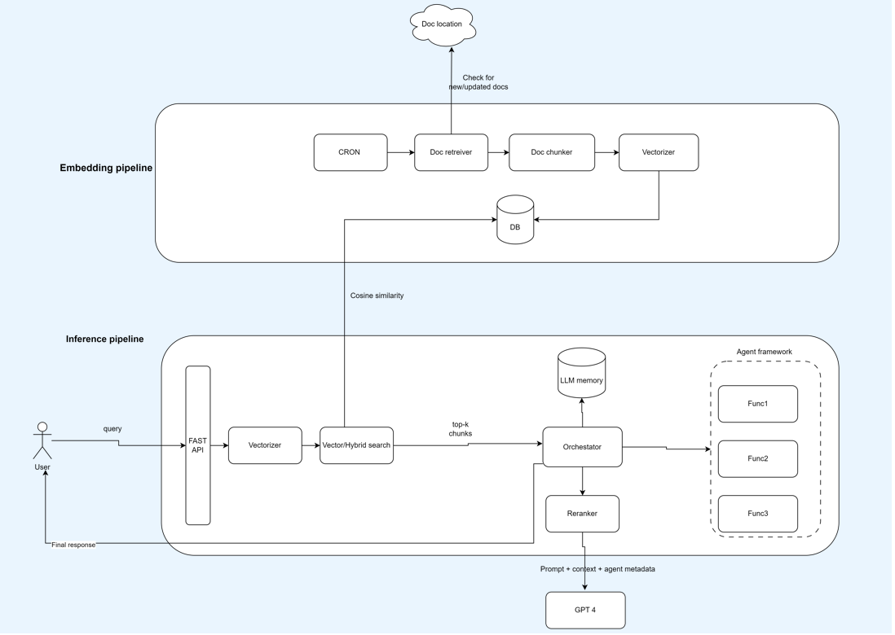

Install
--------
pip install -r requirements.txt


Keys
----
Manually export the below keys before starting the server
set OPENAI_API_KEY= < your key > (needs paid subscription)
set COHERE_API_KEY= < your key > (use free trial one)


Server Start Command
--------------------
Navigate to /Backend
uvicorn fast_api_chat_server:app --reload 


Frontend
---------
Navigate to /Frontend
Open bot.html and type your message


Documents db
------------
Navigate to /data
only csv supported for now. See format in /data


Architecture
-------------




```html
<h2>Example of code</h2>

<pre>
    <div class="container">
        <div class="block two first">
            <h2>Your title</h2>
            <div class="wrap">
            //Your content
            </div>
        </div>
    </div>
</pre>
```